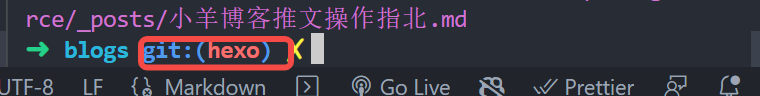

### 从生成到编辑再到推送的详细步骤 - [相关前置环境都会帮小宝配好]
#### 1. 使用vscode打开本地的小羊博客仓库 git分支应在hexo上


如果分支不在hexo上 点击分支切换按钮进行切换


```
j [小羊博客仓库名] 或者`cd`操作切换目录 这一步会帮小羊写好

或者简单使用terminal终端使用 `code .` 打开仓库
```
<!--more-->
### 2. 打开vscode终端
点击下方圆圈删除和警告图标，再点击终端


### 3. 生成新的md文件
聚焦终端使其在可编辑的状态
使用命令 `hexo new '小宝新文章标题'` 生成对应文件
新文件目录地址 source/_posts 下

### 4. 使用markdown语法编辑文章
学习语法 [markdown语法](https://www.jianshu.com/p/ebe52d2d468f, "markdown")

### 5. 完成文章编辑后进行预览 也可以编写边预览
在vscode中点击右上角md文件预览


### 6. 浏览器本地预览博客
在终端输入 `hexo s` 启动服务 默认终端是4000

### 7. 本地确定新的博文没有问题后推送远端
在终端 输入 `hexo g -d` 推送文章 几分钟后远端博客就会同步

### 8. 同步本地和远端仓库文件
在终端依次输入
1. `git add .`
2. `git commit -m '博文更新'`
3. `git push`